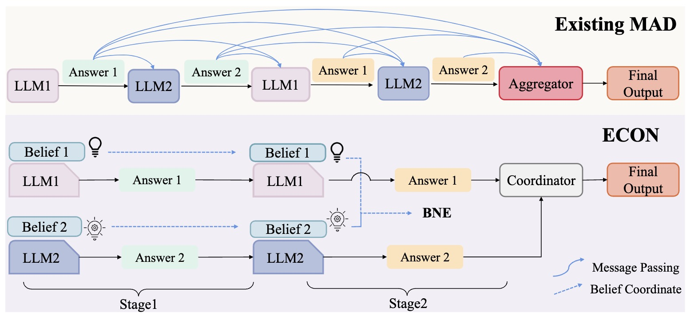
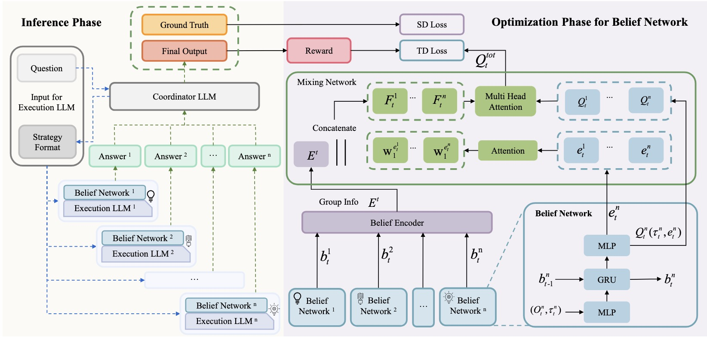

<div align="center">

<h1>From Debate to Equilibrium: Belief‑Driven Multi‑Agent LLM Reasoning via Bayesian Nash Equilibrium</h1>
<h3>Efficient Coordination via Nash Equilibrium for Multi-Agent LLM Framework</h3>

[](https://www.python.org/downloads/)
[](https://pytorch.org/)
[](https://opensource.org/licenses/MIT)
[](https://www.together.ai/)

<div align="center">
    <figure>
        <br>
        <p><em>A multi-agent reinforcement learning framework that combines Large Language Models with coordinated decision-making for complex reasoning tasks</em></p>
    </figure>
</div>

</div>

## Motivation

Existing multi-agent frameworks face significant limitations when applied to Large Language Models (LLMs). Traditional approaches struggle with the high-dimensional nature of language models and lack proper coordination mechanisms for complex reasoning tasks.

<div align="center">
    <figure>
        
        <br>
        <p><em>Comparison between ECON and traditional Multi-Agent Debate (MAD) approaches</em></p>
    </figure>
</div>

Current multi-agent LLM systems suffer from:

- **Prohibitive Communication Costs**: Traditional multi-agent debate relies on explicit message passing, incurring substantial token costs and computational overhead
- **No Convergence Guarantees**: Current approaches lack theoretical assurances of converging to stable, effective solutions
- **Scalability Challenges**: Information exchange often exceeds LLM context limits, severely impeding scalability in large agent ensembles

### Our Solution: ECON Framework

<div align="center">
    <figure>
        
        <br>
        <p><em>ECON's two-stage coordination architecture with Bayesian Nash Equilibrium</em></p>
    </figure>
</div>

To address these critical challenges, we introduce **ECON** - a multi-agent LLM framework that implements efficient coordination via Bayesian Nash Equilibrium, enabling scalable and theoretically grounded multi-agent reasoning.

- **Implicit Belief-Driven Coordination**: Replaces costly message passing with belief-based coordination, dramatically reducing communication overhead
- **Guaranteed Convergence to Equilibrium**: Establishes a rigorous Bayesian Nash Equilibrium (BNE) framework with theoretical convergence guarantees  
- **Hierarchical & Scalable Architecture**: Enables effective coordination in large ensembles via a local-to-global approach that respects LLM context limits

## Examples and Tutorials

### Core Examples

- [**Basic Training Example**](examples/basic_training.py) - Simple setup and execution guide for getting started
- [**Quick Start Script**](examples/quick_start.py) - Interactive demonstration with step-by-step coordination explanation
- [**Custom Configuration**](examples/custom_config.py) - Creating and modifying configurations for different use cases
- [**Multi-Agent Coordination**](examples/coordination_example.py) - Detailed demonstration of BNE coordination mechanisms
- [**Performance Analysis**](examples/analysis_tutorial.py) - Tools for analyzing training results and coordination patterns

### Configuration Examples

- [**Fast Training Config**](examples/configs/fast_training.yaml) - Quick experimentation setup (3 agents, 500K steps)
- [**Large Scale Config**](examples/configs/large_scale.yaml) - Complex problem setup (8 agents, 3M steps)

### Comprehensive Tutorial Guide

For detailed usage instructions, configuration options, and troubleshooting, see the [**Examples README**](examples/README.md) which includes:

- Step-by-step learning path (Beginner → Intermediate → Advanced)
- Configuration customization examples
- Performance optimization tips
- Troubleshooting common issues
- Expected results and benchmarks

## Installation

We provide two installation methods:

### Package Installation (Recommended)

Install the ECON framework dependencies:

```bash
pip install -r requirements.txt
```

### Development Installation

For development or customization, clone the repository and set up the environment:

```bash
# Clone the repository
git clone https://github.com/yourusername/ECON.git
cd ECON

# Create and activate conda environment  
conda create -n econ python=3.8
conda activate econ

# Install dependencies
pip install -r requirements.txt
```

### Model Setup

Before running the framework, you need to set up the Together AI API key:

```bash
export TOGETHER_API_KEY="your_together_ai_api_key"
```

## Usage

### Quick Start with Command Line Interface

After installing the package and setting up your API key, you can immediately start training:

For example, the following command executes the complete training pipeline. It employs 3 executor agents with the `meta-llama/Llama-3.3-70B-Instruct-Turbo` model on the GSM8K dataset, using Bayesian Nash Equilibrium coordination. The training runs for the configured number of steps with 10-step gradient updates.

```bash
./run_econ.sh --api-key YOUR_API_KEY --config src/config/config.yaml --agents 3 --seed 42 --experiment-name "econ-gsm8k-training"
```

For fast training and testing (10 steps):

```bash
./run_econ.sh --api-key YOUR_API_KEY --config examples/configs/fast_training.yaml --agents 3 --seed 42 --experiment-name "econ-fast-test"
```

### Unified Script Interface

Use the main script for complete pipeline execution:

```bash
python src/train.py \
  --config src/config/config.yaml \
  --api_key YOUR_API_KEY \
  --n_agents 3 \
  --env huggingface_dataset_env \
  --seed 42 \
  --experiment_name econ-training
```

### Task Control

For advanced usage and integration into research workflows, you can utilize the Python API. The framework allows you to control various aspects of the training pipeline:

- `coordination`: Enable/disable Bayesian Nash Equilibrium coordination
- `belief_update`: Control belief network update frequency
- `reward_weights`: Adjust Action Likelihood, Task Specific, and Collaborative Contribution reward weights

The following example demonstrates how to use the API to customize the training process:

```python
from src.train import main
from src.utils.config_utils import load_config

# Load and customize configuration
config = load_config("src/config/config.yaml") 
config.n_agents = 5
config.coordinator_model = "meta-llama/Llama-3.3-70B-Instruct-Turbo"
config.train.update_interval = 10

# Run training with custom settings
main(config)
```

### Advanced Coordination

The example below shows how to configure advanced coordination settings for better performance. The framework implements two-stage training with belief formation and BNE coordination.

```python
from src.learners.q_learner import QLearner
from src.controllers.basic_mac import LLMBasicMAC

# Configure BNE coordination parameters
config.bne_max_iterations = 5
config.bne_convergence_threshold = 0.01 
config.stage2_weight = 0.3

# Initialize learner with coordination
learner = QLearner(mac, scheme, logger, config)
learner.train(batch, t_env, episode_num)
```

## Configuration

### Key Parameters

- `n_agents`: Number of executor agents (e.g., 3, 5, 8)
- `coordinator_model`: Coordinator LLM model name  
- `executor_model`: Executor LLM model name
- `update_interval`: Gradient update frequency (default: 10 steps)
- `bne_max_iterations`: Maximum BNE coordination iterations
- `belief_dim`: Dimension of agent belief states

### Supported Models

The framework supports any open-source language model accessible via Together AI API. Models can be hosted using:

- **Together AI**: For remote model serving with API access
- **Local APIs**: Compatible with OpenAI-style APIs

#### Example: Using Llama-3.3-70B-Instruct-Turbo

```bash
./run_econ.sh \
  --api-key YOUR_API_KEY \
  --config src/config/config.yaml \
  --agents 3 \
  --experiment-name llama-coordination-test
```

### Supported Datasets

The framework accepts datasets with the following structure:

#### Built-in Datasets

- `gsm8k`: Grade school math reasoning problems
- `competition_math`: Competition mathematics dataset  
- `huggingface_dataset_env`: General Hugging Face dataset environment

#### Custom Datasets

Create your own datasets following the Hugging Face format with `question` and `answer` fields:

```yaml
env_args:
  hf_dataset_path: "your_custom_dataset"
  dataset_split: "train"
  question_field_name: "question"
  answer_field_name: "answer" 
  max_question_length: 1024
  max_answer_length: 512
```

## Advanced Features

### Architecture Components

- **Coordinator LLM**: Generates strategies (≤50 tokens) and final commitments without revealing answers
- **Executor LLMs**: Multiple agents that process strategies and generate individual responses
- **BeliefNetwork**: Individual agent belief state management with Q-value computation
- **BeliefEncoder**: Group representation aggregation using attention mechanisms
- **Mixer**: Global Q-value computation with QMIX methodology and similarity difference loss

### Bayesian Nash Equilibrium Framework

Our approach implements a rigorous two-stage BNE framework:

1. **Stage 1 - Individual Belief Formation**: Each agent develops independent belief states and generates initial responses
2. **Stage 2 - BNE Coordination**: Agents iteratively update beliefs through equilibrium computation until convergence

### Reward System

Three types of rewards guide the learning process:

- **Action Likelihood (AL)**: Rewards for response consistency and numerical agreement between agents
- **Task Specific (TS)**: Domain-specific correctness rewards based on ground truth evaluation  
- **Collaborative Contribution (CC)**: Rewards for effective multi-agent collaboration and response quality

### Loss Functions

- **TD Loss**: Temporal difference learning for individual agents
- **SD Loss**: Similarity difference between agent features and coordinator commitments
- **BNE Loss**: Belief network consistency and convergence optimization

## Citation

If you find this work useful for your research, please cite:

```bibtex
@inproceedings{
yi2025from,
title={From Debate to Equilibrium: Belief\nobreakdash-Driven Multi\nobreakdash-Agent {LLM} Reasoning via Bayesian Nash Equilibrium},
author={Yi Xie and Zhanke Zhou and Chentao Cao and Qiyu Niu and Tongliang Liu and Bo Han},
booktitle={Forty-second International Conference on Machine Learning},
year={2025},
url={https://openreview.net/forum?id=RQwexjUCxm}
}
```

## Contact

For questions, technical support, or collaboration inquiries:

- Issues: [GitHub Issues](https://github.com/tmlr-group/ECON/issues)
